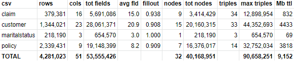
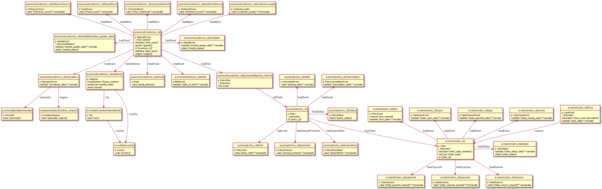

# USE CASE Insurance BY Ontotext

## Context

A potential client gave us simple synthetic data in the Insurance domain (clients, policies, claims):
4 tables, 4.2M rows, resulting in about 90M triples:

The original data is in CSV and we had to transform it then load it from CSV, JSON, RDBMS (mysql) according to the following model.

- `_final.*` is the table name
- `uri:(field)` and `"[field]"` denote source fields to be used in URLs respectively literals
- `urlify()` is a function to replace URI-special chars (similar to `encodeForUri()`)

Loading and about 20-25 benchmark queries and inferences (calculated data) to be tested and timed.

## Challenges

Regarding any resource of the KG construction (input data, ontology, mappings, etc)

1. Various data problems but we'll clean them. Naive scaling: every record is multiplied 21 times, adding `#nn` to IDs
2. The data is very simple (4 tables, 51 columns), but the semantic model is more complex (32 nodes, 84 triples in the model)
3. Some very complex queries, most of all those searching for shortest paths between customers (neighbors and alumni), given a huge branching factor

## Resources

- Website: TODO: We plan to make this case available for testing/benchmarking
- Data: 4.2M rows, 90M triples
- Mappings: TARQL for CSV, R2RML for RDBMS, RML for JSON
- Ontology: custom
- Tool(s): <http://github.com/vladimiralexiev/rdf2rml> to generate model diagram (using plantuml), TARQL, R2RML, RML
- Output: We'll provide CSV, JSON, RDBMS dump, RDF
